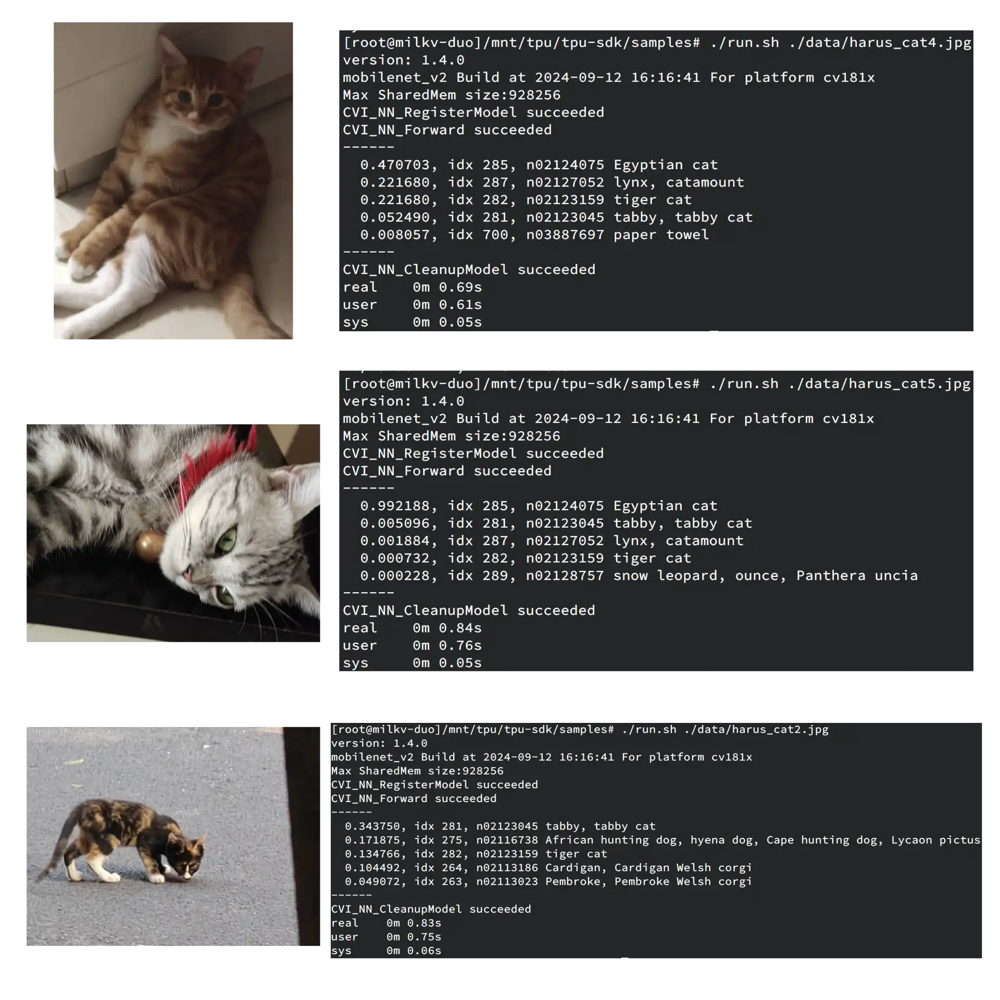

# Demo: Image Classification with MobileNet-Caffe on Milk-V Duo 256M
## Board Information
[Board Documentation (Wiki)](https://milkv.io/docs/duo/getting-started/duo256m)

Applications: IP Camera / Computer Vision IoT products / Edge Computation

## Demo Information
The SG2002 SoC on the Duo 256M comes with a TPU core with 1.0TOPS@INT8, enabling us to run simple Computer Vision-oriented AI/ML applications with adequate speed, such as YOLOv5 Object Recognition and Image Classification. This is an image classification demo with the [MobileNetv2 Caffe](https://github.com/shicai/MobileNet-Caffe) model (converted & quantized into INT8) utilizing the SG2002 TPU core. 

This demo is based on the official Vendor SDK. (This seems to be the only option for the Milk-V Duo series as of now since the SG200x TPU driver is proprietary.)

## Steps to run
1. Setup Docker development environment on host
```
docker run --privileged --name duo_tpudev -v /workspace -it sophgo/tpuc_dev:v3.1
# In the docker shell, run:
cd /workspace
git clone https://github.com/milkv-duo/tpu-mlir.git
source ./tpu-mlir/envsetup.sh
```

2. Retrieve and convert model

In the docker environment, download the model and prepare the dataset:
```
mkdir mobilenet_v2 && cd mobilenet_v2
git clone https://github.com/shicai/MobileNet-Caffe.git
cp MobileNet-Caffe/mobilenet_v2_deploy.prototxt .
cp MobileNet-Caffe/mobilenet_v2.caffemodel .
cp -rf ${TPUC_ROOT}/regression/dataset/ILSVRC2012/ . # we use the ILSVRC2012 dataset as an example
cp -rf ${TPUC_ROOT}/regression/image/ .
mkdir work && cd work
```

We need to convert the MobileNet Caffe model to MLIR and quantize it to a INT8 cvimodel in order for it to be run on the Duo 256M.

First, convert the model to MLIR format to allow it to preprocess input:
```
model_transform.py \
 --model_name mobilenet_v2 \
 --model_def ../mobilenet_v2_deploy.prototxt \
 --model_data ../mobilenet_v2.caffemodel \
 --input_shapes [[1,3,224,224]] \
 --resize_dims=256,256 \
 --mean 103.94,116.78,123.68 \
 --scale 0.017,0.017,0.017 \
 --pixel_format bgr \
 --test_input ../image/cat.jpg \
 --test_result mobilenet_v2_top_outputs.npz \
 --mlir mobilenet_v2.mlir
```
This will generate a `mobilenet_v2.mlir` plus several other preprocessed `.npz` files under cwd. Then, generate the calibration table needed for quantization:
```
run_calibration.py mobilenet_v2.mlir --dataset ../ILSVRC2012 --input_num 100 -o mobilenet_v2_cali_table
```
This will generate a calibration table named `mobilenet_v2_cali_table`. Next, quantize the MLIR model to INT8:
```
model_deploy.py \
 --mlir mobilenet_v2.mlir \
 --asymmetric \
 --calibration_table mobilenet_v2_cali_table \
 --fuse_preprocess \
 --customization_format BGR_PLANAR \
 --chip cv181x \ # SG200x series SoC
 --quantize INT8 \
 --test_input ../image/cat.jpg \
 --model mobilenet_v2_int8_asym.cvimodel
```
The resulting `mobilenet_v2_int8_asym.cvimodel` is the model we will run on the board. 

3. Upload model to board

In the docker environment, run:
```
cd /workspace
git clone https://github.com/milkv-duo/tpu-sdk-sg200x.git
mv ./tpu-sdk-sg200x ./tpu-sdk
```
Upload `tpu-sdk` directory and `mobilenet_v2_int8_asym.cvimodel` to the board (put the latter under the former)

In the board's serial console, `cd` to the said directory and run `source ./envs_tpu_sdk.sh`.

4. Run model

upload input images to `./samples/data/`, then `cd` to `./samples`. Run the model with e.g.:
```
./bin/cvi_sample_classifier_fused_preprocess \
 ../mobilenet_v2_int8_asym.cvimodel \
 ./data/cat.jpg \
 ./data/synset_words.txt
```

Here are my sample runs (with some pictures of my friend's cats. For convenience, I used the wrapper script `run.sh` in place of the command above):

