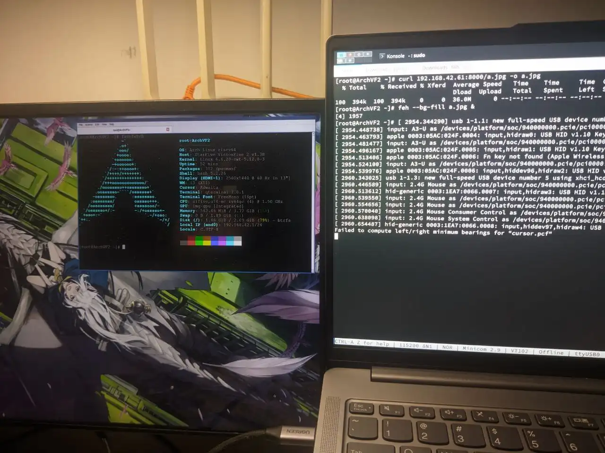

# month1/week3
## `lintestor` project
### Bug fixes
- [fix: duplicated test modules](https://github.com/255doesnotexist/lintestor/commit/1c376106442daa26d01ba78622cff4a4353d2023)
- [fix: output handling of missing packages](https://github.com/255doesnotexist/lintestor/commit/7d5f3a73351cedf53dac3700bb31356776cfa266)
- [fix: false positive metadata.sh missing warning](https://github.com/255doesnotexist/lintestor/commit/1cf9b9133464eb7928f5ed550914d4931c2a597e)
- [chores: make clippy happy](https://github.com/255doesnotexist/lintestor/commit/d8fd7110a7537682a68f75298c4fd77f3ba57c54)
- [bump dependencies](https://github.com/255doesnotexist/lintestor/pull/39)
### Collaboration
- Reviewed PR from PangLARS: [#38](https://github.com/255doesnotexist/lintestor/pull/38)

## Testing
- Received a Visionfive 2 board from mentor. Managed to get a X11 server up and running in [Arch Linux RISC-V](https://github.com/ruyisdk/support-matrix/blob/main/VisionFive2/ArchLinux/README_zh.md) (Pictured here is an i3 shell with qterminal and feh): 

This is done by copying the Imagination GPU blobs provided by StarFive at https://github.com/starfive-tech/Debian/tree/20221225T084846Z/gpu with some other minor hacks. Later I will wrote a more detailed documentation for it and have this method tested on other distros available for the VF2.
- Spent hours trying to compile [UniProton for Milk-V Duo](https://github.com/openeuler-riscv/duo-buildroot-sdk). Made some progress after editing certain Makefiles, but is currently stuck here:
