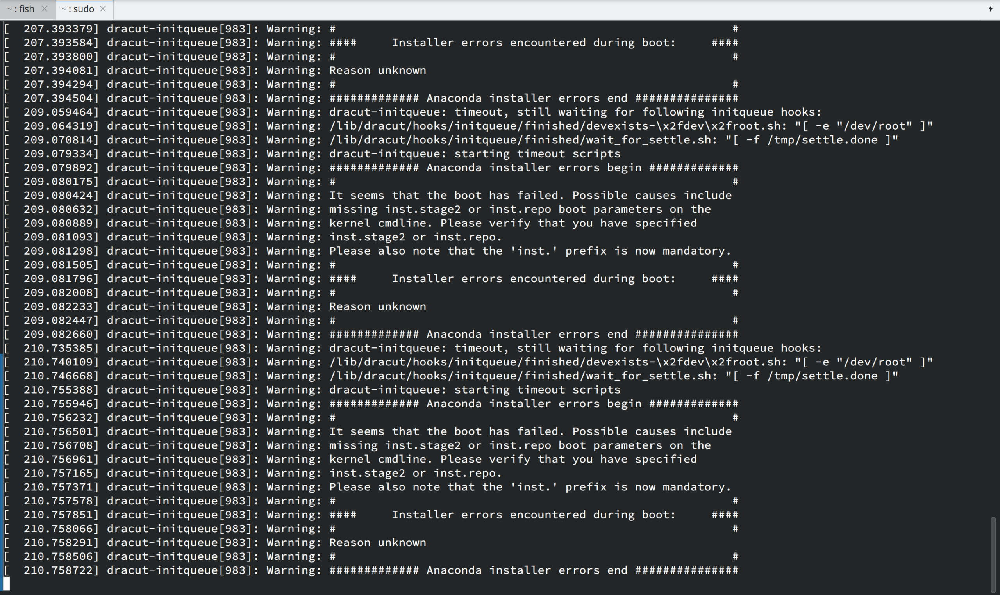

# month13

产出记录：20251001-20251031

## 测试

### dbtest

PR: [Update SG2042/openGauss7.0.0](https://github.com/QA-Team-lo/dbtest/pull/4)
进行了 openGauss 7.0.0 全量版在 SG2042/Pioneer 的 openEuler 容器中的可用性测试。

### litmus-tests
PR: https://github.com/QA-Team-lo/litmus-tests/pull/1

完成了针对以下平台的 Litmus 测试，并上传了测试数据等结果：

- TH1520
- JH7110
- EIC7700X
- D1 （失败，内存不足）
- K230 （失败，内存不足）

## 开发

### uboot-builder

https://github.com/aisuneko/uboot-builder

一个实验性的主线 U-Boot/OpenSBI 的 GitHub Actions 构建脚本。

目前支持 HiFive Unmatched 和 Milk-V Duo (packed fip.bin) 的主线 U-Boot 自动化构建作为 PoC，可以很方便地添加对其他 target 的支持。

## 其他

验证了 openEuler 25.09 的 ISO 镜像 （openEuler-25.09-riscv64-dvd.iso）在 Visionfive 2 (v1.3b) 上的可用性。

需要使用较新的 U-Boot SPL (e.g. `2025.01-1~0ubuntu2`) 方可正常启动，但加载内核进入用户态前卡在了上图所示的地方。原因尚不明确，暂未撰写测试报告。
