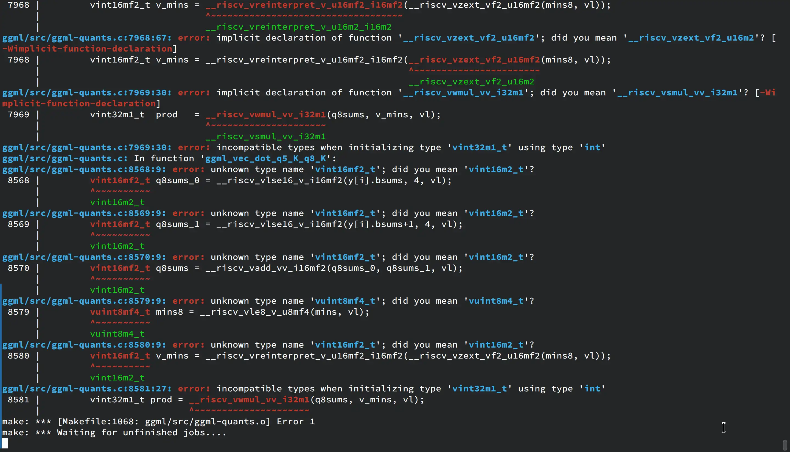

# week3 (month0/week2)
What I did this week:
## `lintestor` development
### New feature: Package metadata implementation
- [feat: independent package metadata](https://github.com/255doesnotexist/lintestor/commit/5c7189e415bb498d3ef24af1520ab86a618f1b13): Completed a draft implementation of package metadata
  - Implemented a `PackageMetadata` struct for storing these extra metadata.
    - New fields include: package_version, package_pretty_name, package_type, package_description
    - They are read through `metadata.sh` files defined under each package's subdirectory.
- [feat: revise markdown report format](https://github.com/255doesnotexist/lintestor/commit/2e78791eee4ae20a33c8c333a4034083e011334e): Revised format of generated markdown report (summary.md).
  - Reflected the above metadata feature change
  - Added columns for displaying system information of the environment the scripts were run on, utilizing existing `os_version` field in the `Report` struct

### Maintenance and Documentation
- [docs: update usage guide to reflect package metadata feature](https://github.com/255doesnotexist/lintestor/commit/f9d4acf9965d444aec8fd469c6f2a8ffc53464c8): Updated relevant sections of the usage guide (both Chinese and English) to document the above package metadata feature.
- [fix: enhance title of markdown reports](https://github.com/255doesnotexist/lintestor/commit/71a9397ce4292f02ae97025b4487d3808bf53696): Small changes to enhance the title display of summary.md reports

### Collaboration
- Notified @255doesnotexist about the above feature change, who later enhanced my implementation and did extensive work (such as adding metadata.sh for all existing tests.) 
- Assigned to and closed issue [#6](https://github.com/255doesnotexist/lintestor/issues/6).
- Also discussed with @wychlw on a possible "persistent shell" implementation (as an alternative to `std::process::Command`), derived from her project [autotester](https://github.com/wychlw/autotester/blob/main/src/cli/shell.rs), while I was developing the above feature. ~~Though I eventually did not incorporate it into `lintestor`, it turns out to be a promising byproduct of our projects.~~

## Demo
Tried running [llama.cpp](https://github.com/ggerganov/llama.cpp) (with 
[Qwen2-0.5B-Instruct-GGUF](https://huggingface.co/Qwen/Qwen2-0.5B-Instruct-GGUF) Q3_K_M) on the Duo 256M, but was later put on hiatus. My activity record is as follows:
- Tried cross-compiling `llama.cpp` to RISC-V targets with: `RISCV_CROSS_COMPILE=1 RISCV=1`, with GCC 14.2.0
  - The resulting binary would not execute at all on the official Milk-V buildroot image. `readelf -l llama-cli | grep "program interpreter"` shows that it depends on `/lib/ld-linux-riscv64-lp64d.so.1`, meaning that it is only compatible with full-fledged distros such as Debian.
- The resulting `llama-cli` binary yields **"Illegal instruction"** on the Duo 256M. 
  - In theory, `llama.cpp` only requires `rv64gcv`, while the SG2002 SoC on the Duo 256M supports `rv64gcvsu`.
  - full GDB debugging log:
    ```
    root@duo256:/mnt/llama# gdb ./llama-cli
    GNU gdb (Debian 15.1-1) 15.1
    Copyright (C) 2024 Free Software Foundation, Inc.
    License GPLv3+: GNU GPL version 3 or later <http://gnu.org/licenses/gpl.html>
    This is free software: you are free to change and redistribute it.
    There is NO WARRANTY, to the extent permitted by law.
    Type "show copying" and "show warranty" for details.
    This GDB was configured as "riscv64-linux-gnu".
    Type "show configuration" for configuration details.
    For bug reporting instructions, please see:
    <https://www.gnu.org/software/gdb/bugs/>.
    Find the GDB manual and other documentation resources online at:
        <http://www.gnu.org/software/gdb/documentation/>.
    
    For help, type "help".
    Type "apropos word" to search for commands related to "word"...
    Reading symbols from ./llama-cli...
    (gdb) r
    Starting program: /mnt/llama/llama-cli 
    [Thread debugging using libthread_db enabled]
    Using host libthread_db library "/lib/riscv64-linux-gnu/libthread_db.so.1".
    Program received signal SIGILL, Illegal instruction.
    0x0000002aaab58102 in std::char_traits<char>::copy (__s1=<optimized out>, __s2=0x2aaac6ad70 "token_embd", __n=<optimized out>)
        at /usr/riscv64-linux-gnu/include/c++/14.2.0/bits/char_traits.h:427
    warning: 427    /usr/riscv64-linux-gnu/include/c++/14.2.0/bits/char_traits.h: No such file or directory
    (gdb) bt
    #0  0x0000002aaab58102 in std::char_traits<char>::copy (__s1=<optimized out>, __s2=0x2aaac6ad70 "token_embd", __n=<optimized out>)
        at /usr/riscv64-linux-gnu/include/c++/14.2.0/bits/char_traits.h:427
    #1  std::__cxx11::basic_string<char, std::char_traits<char>, std::allocator<char> >::_S_copy (__d=<optimized out>, 
        __s=0x2aaac6ad70 "token_embd", __n=<optimized out>) at /usr/riscv64-linux-gnu/include/c++/14.2.0/bits/basic_string.h:435
    #2  std::__cxx11::basic_string<char, std::char_traits<char>, std::allocator<char> >::_S_copy (__d=<optimized out>, 
        __s=0x2aaac6ad70 "token_embd", __n=<optimized out>) at /usr/riscv64-linux-gnu/include/c++/14.2.0/bits/basic_string.h:430
    #3  std::__cxx11::basic_string<char, std::char_traits<char>, std::allocator<char> >::_S_copy_chars (__p=<optimized out>, 
        __k1=0x2aaac6ad70 "token_embd", __k2=<optimized out>) at /usr/riscv64-linux-gnu/include/c++/14.2.0/bits/basic_string.h:489
    #4  std::__cxx11::basic_string<char, std::char_traits<char>, std::allocator<char> >::_M_construct<char const*> (this=0x3fffffe098, 
        __beg=0x2aaac6ad70 "token_embd", __end=<optimized out>) at /usr/riscv64-linux-gnu/include/c++/14.2.0/bits/basic_string.tcc:247
    #5  std::__cxx11::basic_string<char, std::char_traits<char>, std::allocator<char> >::basic_string (this=this@entry=0x3fffffe098, 
        __s=__s@entry=0x2aaac6ad70 "token_embd", __a=...) at /usr/riscv64-linux-gnu/include/c++/14.2.0/bits/basic_string.h:654
    #6  0x0000002aaaae0b4e in std::pair<llm_tensor const, std::__cxx11::basic_string<char, std::char_traits<char>, std::allocator<char> > >::pair<llm_tensor, char const (&) [11], true> (this=0x3fffffe090, __x=<optimized out>, __y=...)
        at /usr/riscv64-linux-gnu/include/c++/14.2.0/bits/stl_pair.h:882
    #7  __static_initialization_and_destruction_0 () at src/llama.cpp:21394
    #8  0x0000003ff7bb09e8 in call_init (env=<optimized out>, argv=0x3ffffffbd8, argc=1) at ./csu/libc-start.c:145
    #9  __libc_start_main_impl (main=0x2aaaaeb746 <main(int, char**)>, argc=1, argv=0x3ffffffbd8, init=<optimized out>, fini=<optimized out>, 
        rtld_fini=<optimized out>, stack_end=<optimized out>) at ./csu/libc-start.c:347
    #10 0x0000002aaaaeea70 in _start ()
    (gdb) disassemble 
    Dump of assembler code for function _ZNSt7__cxx1112basic_stringIcSt11char_traitsIcESaIcEEC4EPKcRKS3_:
       0x0000002aaab580ae <+0>:     addi    sp,sp,-64
       0x0000002aaab580b0 <+2>:     sd      s1,40(sp)
       0x0000002aaab580b2 <+4>:     sd      ra,56(sp)
       0x0000002aaab580b4 <+6>:     sd      s0,48(sp)
       0x0000002aaab580b6 <+8>:     sd      s2,32(sp)
       0x0000002aaab580b8 <+10>:    sd      s3,24(sp)
       0x0000002aaab580ba <+12>:    addi    s1,a0,16
       0x0000002aaab580be <+16>:    sd      s1,0(a0)
       0x0000002aaab580c0 <+18>:    beqz    a1,0x2aaab58146 <_ZNSt7__cxx1112basic_stringIcSt11char_traitsIcESaIcEEC4EPKcRKS3_+152>
       0x0000002aaab580c2 <+20>:    mv      s2,a0
       0x0000002aaab580c4 <+22>:    mv      a0,a1
       0x0000002aaab580c6 <+24>:    mv      s3,a1
       0x0000002aaab580c8 <+26>:    jal     0x2aaaade190 <strlen@plt>
       0x0000002aaab580cc <+30>:    sd      a0,8(sp)
       0x0000002aaab580ce <+32>:    li      a5,15
       0x0000002aaab580d0 <+34>:    mv      s0,a0
       0x0000002aaab580d2 <+36>:    bltu    a5,a0,0x2aaab5811a <_ZNSt7__cxx1112basic_stringIcSt11char_traitsIcESaIcEEC4EPKcRKS3_+108>
       0x0000002aaab580d6 <+40>:    li      a5,1
       0x0000002aaab580d8 <+42>:    bne     a0,a5,0x2aaab580fc <_ZNSt7__cxx1112basic_stringIcSt11char_traitsIcESaIcEEC4EPKcRKS3_+78>
       0x0000002aaab580dc <+46>:    lbu     a5,0(s3)
       0x0000002aaab580e0 <+50>:    sb      a5,16(s2)
       0x0000002aaab580e4 <+54>:    sd      s0,8(s2)
       0x0000002aaab580e8 <+58>:    add     s1,s1,s0
       0x0000002aaab580ea <+60>:    sb      zero,0(s1)
       0x0000002aaab580ee <+64>:    ld      ra,56(sp)
       0x0000002aaab580f0 <+66>:    ld      s0,48(sp)
       0x0000002aaab580f2 <In theory, ``c_stringIcSt11char_traitsIcESaIcEEC4EPKcRKS3_+54>
       0x0000002aaab580fe <+80>:    vsetvli a5,s0,e8,m8,ta,ma
    => 0x0000002aaab58102 <+84>:    vle8.v  v8,(s3)
       0x0000002aaab58106 <+88>:    sub     s0,s0,a5
       0x0000002aaab58108 <+90>:    add     s3,s3,a5
       0x0000002aaab5810a <+92>:    vse8.v  v8,(s1)
       0x0000002aaab5810e <+96>:    add     s1,s1,a5
       0x0000002aaab58110 <+98>:    bnez    s0,0x2aaab580fe <_ZNSt7__cxx1112basic_stringIcSt11char_traitsIcESaIcEEC4EPKcRKS3_+80>
    --Type <RET> for more, q to quit, c to continue without paging--
    ```
    We could see that the program breaks at the `vle8.v` instruction, which is defined in the `1.0` version of the RISC-V vector extension intrinsics, while the chip only supports version `0.7.1`.
-   Tried rebuilding `llama.cpp` with `-march=rv64gc_xtheadvector`, but failed:
 
    

    This is weird because rvv 1.0 should be compatible with xtheadvector intrinsics (after consulting other members in the team). I assume that `llama.cpp` does not natively support `xtheadvector` for now.


## Future plans
- One of the team members mentioned that the using OpenBLAS as backend for `llama.cpp` might work. Will give it a try later. 
- I have one more idea for a demo...